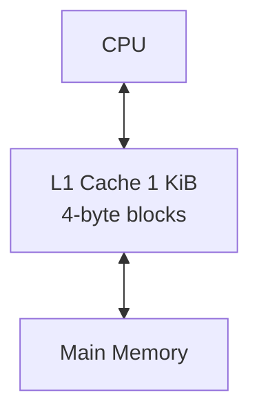

A README.md that show evidences of the CPU working properly with the program.
A short narrative to state the challenges you encountered as a team.
Comments about any design decisions you made that are not obvious.
A reflection on what you might do differently if you were to start again.

# Team 14 – RISC-V CPU Project
[Go to](#repo-structure) Repository Structure and Personal Statements 

[Go to](#single-cycle-risc-v-processor) Single Cycle CPU

[Go to](#pipelined-risc-v-processor) Pipeline Implementation 

[Go to](#cache) Cache Implementation

[Go to](#further-enhancements-full-rv32i-design) Further Enhancements: Full RV32I Design

[Go to](#future-considerations) Future considerations 

[Go to](#acknowledgements) Acknowledgements

## Repo structure 
As a team, we each worked on our own branches while keeping main for finalized, tested CPU versions. After completing a section, we merged our branch into main and removed any no-longer-needed branches to maintain a clear, tidy repository for examination.

COMMMENT: address the github structure and where everything is located 

## Details and personal statements 
| Name                  | CID      | Email                                   | Link to personal statement |
|-----------------------|----------|-----------------------------------------|-----------------------------|
| Aileen Sangalli       | 02561984 | aileen.sangalli24@imperial.ac.uk        |    [Aileen’s Statement](statements/aileen.md)                         |
| Jeshmeera Siventhiran | 02561534 | jeshmeera.siventhiran24@imperial.ac.uk  |                             |
| Phillippa Flintoff     | 02596628 | phillippa.flintoff24@imperial.ac.uk      |                             |
| Venice Gainfort-Head  | 02559434 | venice.gainfort-head24@imperial.ac.uk   |                             |

## Introduction 

Our project implements a fully functional 5-stage pipelined RISC-V RV32I processor, supporting all base user-level instructions defined in the RISC-V Unprivileged ISA. The design follows the classical pipeline structure of Fetch, Decode, Execute, Memory, and Writeback, and incorporates full hazard detection, stalling, and data forwarding to ensure correct execution of dependent instructions. We implemented the complete processor in SystemVerilog, following a modular architecture that allowed us to iteratively verify, refine, and extend each stage.

We further enhanced the design by refining the pipeline’s hazard management and forwarding paths to maintain high instruction throughput with minimal stalling. In addition, we implemented a simple Level-1 cache that interfaces with the Memory stage, reducing load/store latency and improving overall processor performance.

## Overall CPU Diagram 

## Single Cycle RISC-V Processor 

Our single-cycle Processor successfully executes RISC-V instructions, with each instruction completing in one clock cycle by preforming instruction fetch, decode, execute, memory access, and write back within a single unified datapath. 

### Task allocation 

| Modules      | Aileen | Jeshmeera | Phillippa | Venice |
|--------------|--------|-----------|----------|--------|
| ALU          |        |           | c        | w      |
| Branch_adder |        | w         |          |        |
| Control Unit | w      |           | w        |        |
| Data_mem     | w      |           |          | w      |
| Instr_mem    | c      |           | w        |        |
| JALR_mask    | w      |           |          |        |
| Load_selc    | w      |           |          |        |
| mux4         |        |           |          | w      |
| pc_plus_4    |        | w         |          |        |
| pc_reg       |        | w         |          |        |
| reg_file     | c      |           |          | w      |
| sign_extend  |        |           | w        |        |
| top          |        | w         | w        | w      |
|f1_asm.s      | w      | w         |          |        |       

w - main module writer 

c - contributor 

NOTE: In the single-cycle implementation of the processor, Aileen served as the Implementation Lead, validating majority of the core implementation work and also handling debugging and testing to ensure the single-cycle design operated correctly.

### Single Cycle CPU Diagram 

### Instructions Implemented 

| Type | Pseudoinstruction | RISC-V Instruction     | Description              | Operation                       |
|------|--------------------|-------------------------|--------------------------|----------------------------------|
| J    | jal label          | jal ra, label           | jump and link            | PC = LABEL, ra = PC + 4          |
| I    | jalr rs1           | jalr ra, rs1, 0         | jump and link register   | PC = rs1, ra = PC + 4            |
| I    | lbu                | lbu rd, Imm(rs1)        | load byte unsigned       | rd = ZeroExt([Address]7:0)       |
| I    | addi               | addi rd, rs1, Imm       | add immediate            | rd = rs1 + signext(Imm)          |
| S    | sb                 | sb rs2, Imm(rs1)        | store byte               | [Address]7:0 = rs2[7:0]          |
| B    | bne                | bne rs1, rs2, label     | branch if not equal      | if (rs1 ≠ rs2) PC = BTA          |
| U    | lui                | lui rd, upImm           | load upper immediate     | rd = {upImm, 12'b0}              |
| R    | add                | add rd, rs1, rs2        | add                      | rd = rs1 + rs2                   |

Extra: 

| Type | Pseudoinstruction | RISC-V Instruction     | Description         | Operation                       |
|------|--------------------|-------------------------|---------------------|----------------------------------|
| I    | ori                | ori rd, rs1, imm        | or immediate        | rd = rs1 OR signext(imm)         |
| B    | beq                | beq rs1, rs2, label     | branch if equal     | if (rs1 == rs2) PC = BTA          |

### Testing 
See below our single cpu passing all of the five tests given in verify.cpp: 

#### Testing videos 
##### f1 lights  

https://github.com/user-attachments/assets/1cd3efb5-847b-40b7-86f0-a89b948396de

#### guassian.mem 

https://github.com/user-attachments/assets/57de37f1-a582-495e-95b6-ba75b1612954

#### triangle.mem 

https://github.com/user-attachments/assets/d6829022-59fc-400f-8bea-2608a3759b34

#### noisy.mem 

https://github.com/user-attachments/assets/4b7d8409-93f4-4ae9-9395-f1d673b66e5c

#### sine.mem 
We tested this using the data from lab 2. 

https://github.com/user-attachments/assets/e6092f2c-c3c5-410d-b5ad-00c11a1076be

## Pipelined RISC-V Processor

Our team successfully implemented a pipelined RISC-V processor that executes multiple instructions concurrently accross the IF, ID, EX, MEM, and WB stages. We also implemented fully working Hazard detection, stalling, and forwarding logic to ensure that the pipeline operates correctly for all instruction types. 

### Task allocation 

| Modules        | Aileen | Jeshmeera | Phillippa| Venice |
|----------------|--------|-----------|----------|--------|
| Control Unit   | w      |           | c        |        |
| mux3           |        |           |          | w      |
| pc_source      | w      |           |          |        | 
| IF_ID_Reg      |        | w         |          |        | 
| ID_EX_Reg      |        | w         |          |        |
| EX_Me_Reg      |        |           |          | w      | 
| ME_WR_Reg      |        |           |          | w      | 
| HazardUnit     |        | w         |          |        | 
| ForwardingUnit |        | w         |          |        | 
| top            |        |           | w        | w      |   

w - main module writer 

c - contributor 

NOTE: In the pipelined portion of the project Aileen served as the Implementation lead and Pippa as the Implementation Support. They carried out majority of the implementation work and were also responsible for debugging and testing the design to ensure that all components functioned correctly. 

### Pipelined CPU Diagram 

### Testing 

Our pipelined processor successfully executed all .mem test programs, producing results identical to the results we produced with the single-cycle processor. 

## Cache 

As a team, we successfully integrated a set-associative L1 data cache to the pipelined RISC-V processor to keep frequenctly accessed memory closer to the processor for faster access. The cache uses temporal and spatial locality to decide which data should remain in the cache and which data should be evicted. 

### Task allocation 

| Modules        | Aileen | Jeshmeera | Phillippa| Venice |
|----------------|--------|-----------|----------|--------|
| Cache          | w      |           | w        |        |

w - main module writer 

c - contributor 

### Memory heirarchy 

In our Cache implented RISC-V processor, the memory heirarchy places a small, fast 1 KiB L1 cache between the CPU and the main memory to reduce access latency. The CPU interacts with the cache first, which stores recently used data in 4-byte blocks, exploiting temporal and spatial locality to improve preformance. When the required data is not present in the cache, the processor retrieves it from the main memory, ensuring both correctness and efficiency in our design. 

### Testing 
- screenshot gtk wave 

## Further Enhancements: Full RV32I Design

## Future Considerations 

In future iterations of our RISC-V processor, several architectiral enhancements can be integrated to significantly improve preformance and efficiency. The main potential developements we, as a team, want to implement would focus on further reducing pipeline stalls, increasing instructions overall, and incoperating more advanced techniques that extend beyond our current implementation. 

Potential enhancements: 

- Introduce branch prediction: Implementing static or dynamic branch prediction would help reduce control hazards and minimise pipeline stalls, improving preformance on the branch-heavy workloads. 

- Improve pipeline efficiency: Redefining the forwarding paths, eliminating unnecessary stalls, and potentially adding speculative execution would allow the pipeline to operate more efficiently and increase overall instruction throughout. 

## Acknowledgements

We would like to acknowledge Digital Design and Computer Architecture (RISC-V Edition) by Sarah Harris and David Harris for its clear explanations and diagrams, which supported our understanding and guided aspects of our CPU design.
