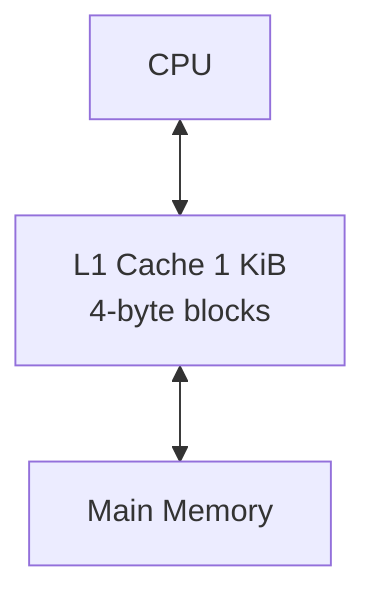

# Team 14 – RISC-V CPU Project
[Go to](#repo-structure) Repository Structure and Personal Statements 

[Go to](#single-cycle-risc-v-processor) Single Cycle CPU

[Go to](#pipelined-risc-v-processor) Pipeline Implementation 

[Go to](#cache) Cache Implementation

[Go to](#challenges-we-faced-as-a-team) Challenges we Faced as a Team

[Go to](#design-decisions) Design Decisions

[Go to](#future-considerations) Future considerations 

[Go to](#acknowledgements) Acknowledgements

## Repo structure 
As a team, we each worked on our own branches while keeping main for finalized, tested CPU versions. After completing a section, we merged our branch into main and removed any no-longer-needed branches to maintain a clear, tidy repository for examination.

We have branches for each section of our project: iac_simple_cycle, iac_pipelined_cpu, iac_write_through_cache.

## Details and personal statements 

| Name                  | CID      | Email                                   | Link to personal statement                         |
|-----------------------|----------|-----------------------------------------|-----------------------------------------------------|
| Aileen Sangalli       | 02561984 | aileen.sangalli24@imperial.ac.uk        | [Aileen's statement](personal%20statements/Aileen.md)              |
| Jeshmeera Siventhiran | 02561534 | jeshmeera.siventhiran24@imperial.ac.uk  | [Jeshmeera's statement](personal%20statements/Jeshmeera.md)        |
| Phillippa Flintoff    | 02596628 | phillippa.flintoff24@imperial.ac.uk     | [Phillippa's statement](personal%20statements/Phillippa.md)        |
| Venice Gainfort-Head  | 02559434 | venice.gainfort-head24@imperial.ac.uk   | [Venice's statement](personal%20statements/Venice.md)              |

## Introduction 

Our project implements a fully functional 5-stage pipelined RISC-V RV32I processor, supporting all base user-level instructions defined in the RISC-V Unprivileged ISA. The design follows the classical pipeline structure of Fetch, Decode, Execute, Memory, and Writeback, and incorporates full hazard detection, stalling, and data forwarding to ensure correct execution of dependent instructions. We implemented the complete processor in SystemVerilog, following a modular architecture that allowed us to iteratively verify, refine, and extend each stage.

We further enhanced the design by refining the pipeline’s hazard management and forwarding paths to maintain high instruction throughput with minimal stalling. In addition, we implemented a simple Level-1 cache that interfaces with the Memory stage, reducing load/store latency and improving overall processor performance.

## Overall CPU Diagram 

## Single Cycle RISC-V Processor 

Our single-cycle Processor successfully executes RISC-V instructions, with each instruction completing in one clock cycle by performing instruction fetch, decode, execute, memory access, and write back within a single unified datapath. 

### Task allocation 

| Modules      | Aileen | Jeshmeera | Phillippa | Venice |
|--------------|--------|-----------|----------|--------|
| ALU          |        |           | c        | w      |
| Branch_adder |        | w         |          |        |
| Control Unit | w      |           | w        |        |
| Data_mem     | w      |           |          | w      |
| Instr_mem    | c      |           | w        |        |
| JALR_mask    | w      |           |          |        |
| Load_selc    | w      |           |          |        |
| mux4         |        |           |          | w      |
| pc_plus_4    |        | w         |          |        |
| pc_reg       |        | w         |          |        |
| reg_file     | c      |           |          | w      |
| sign_extend  |        |           | w        |        |
| top          |        | w         | w        | w      |
|f1_asm.s      | w      | w         |          |        |       

w - main module writer 

c - contributor 

NOTE: In the single-cycle implementation of the processor, Aileen served as the Implementation Lead, validating majority of the core implementation work and also handling debugging and testing to ensure the single-cycle design operated correctly.

### Single Cycle CPU Diagram 

### Instructions Implemented 

| Type | Pseudoinstruction | RISC-V Instruction     | Description              | Operation                       |
|------|--------------------|-------------------------|--------------------------|----------------------------------|
| J    | jal label          | jal ra, label           | jump and link            | PC = LABEL, ra = PC + 4          |
| I    | jalr rs1           | jalr ra, rs1, 0         | jump and link register   | PC = rs1, ra = PC + 4            |
| I    | lbu                | lbu rd, Imm(rs1)        | load byte unsigned       | rd = ZeroExt([Address]7:0)       |
| I    | addi               | addi rd, rs1, Imm       | add immediate            | rd = rs1 + signext(Imm)          |
| S    | sb                 | sb rs2, Imm(rs1)        | store byte               | [Address]7:0 = rs2[7:0]          |
| B    | bne                | bne rs1, rs2, label     | branch if not equal      | if (rs1 ≠ rs2) PC = BTA          |
| U    | lui                | lui rd, upImm           | load upper immediate     | rd = {upImm, 12'b0}              |
| R    | add                | add rd, rs1, rs2        | add                      | rd = rs1 + rs2                   |

Extra: 

| Type | Pseudoinstruction | RISC-V Instruction     | Description         | Operation                       |
|------|--------------------|-------------------------|---------------------|----------------------------------|
| I    | ori                | ori rd, rs1, imm        | or immediate        | rd = rs1 OR signext(imm)         |
| B    | beq                | beq rs1, rs2, label     | branch if equal     | if (rs1 == rs2) PC = BTA          |

### Testing 
See below our single cpu passing all of the five tests given in verify.cpp: 

#### Testing videos 
##### f1 lights  

https://github.com/user-attachments/assets/1cd3efb5-847b-40b7-86f0-a89b948396de

#### guassian.mem 

https://github.com/user-attachments/assets/57de37f1-a582-495e-95b6-ba75b1612954

#### triangle.mem 

https://github.com/user-attachments/assets/d6829022-59fc-400f-8bea-2608a3759b34

#### noisy.mem 

https://github.com/user-attachments/assets/4b7d8409-93f4-4ae9-9395-f1d673b66e5c

#### sine.mem 
We tested this using the data from lab 2. 

https://github.com/user-attachments/assets/e6092f2c-c3c5-410d-b5ad-00c11a1076be

## Pipelined RISC-V Processor

Our team successfully implemented a pipelined RISC-V processor that executes multiple instructions concurrently across the IF, ID, EX, MEM, and WB stages. We also implemented fully working Hazard detection, stalling, and forwarding logic to ensure that the pipeline operates correctly for all instruction types. 

### Task allocation 

| Modules        | Aileen | Jeshmeera | Phillippa| Venice |
|----------------|--------|-----------|----------|--------|
| Control Unit   | w      |           | c        |        |
| mux3           |        |           |          | w      |
| pc_source      | w      |           |          |        | 
| IF_ID_Reg      |        | w         |          |        | 
| ID_EX_Reg      |        | w         |          |        |
| EX_Me_Reg      |        |           |          | w      | 
| ME_WR_Reg      |        |           |          | w      | 
| HazardUnit     |        | w         |          |        | 
| ForwardingUnit |        | w         |          |        | 
| top            |        |           | w        | w      |   

w - main module writer 

c - contributor 

NOTE: In the pipelined portion of the project Aileen served as the Implementation lead and Pippa as the Implementation Support. They carried out majority of the implementation work and were also responsible for debugging and testing the design to ensure that all components functioned correctly. 

### Pipelined CPU Diagram 

### Testing 

Our pipelined processor successfully executed all .mem test programs, producing results identical to the results we produced with the single-cycle processor. 

Here is evidence of our pipelined processor working in gtkWave: 

The waveform above is produced when we tested this assembly code: 

This demonstrates that hazards are being handled correctly: during the lbu instruction the appropriate stall and flush signals are asserted, and the forwarding logic activates as expected. The correct values are also forwarded and loaded into t0, confirming proper pipeline behavior.

## Cache 

As a team, we successfully integrated a 2-way-set-associative L1 data cache to the pipelined RISC-V processor to keep frequenctly accessed memory closer to the processor for faster access. The cache uses temporal locality (least recently used eviction) to decide which data should remain in the cache and which data should be evicted. We decided to implement a write-through cache since no specific policy was specified; therefore, data is written to both the cache and main memory simultaneously.

### Task allocation 

| Modules        | Aileen | Jeshmeera | Phillippa| Venice |
|----------------|--------|-----------|----------|--------|
| Cache          | w      |           | w        |        |

w - main module writer 

c - contributor 

### Memory hierarchy 

In our Cache implented RISC-V processor, the memory hierarchy places a small, fast 1 KiB L1 cache between the CPU and the main memory to reduce access latency. The CPU interacts with the cache first, which stores recently used data in 4-byte blocks, exploiting temporal locality to improve preformance. When the required data is not present in the cache, the processor retrieves it from the main memory, ensuring both correctness and efficiency in our design.

### Testing 

Here is evidence our Cache working:

The waveforms below were produced when we tested this assembly code: 

In the image above, MemWrite is high while Hit is low, which causes MissWrite to be high; as a result, the data is written directly to main memory.

In the image above, we see the memory address change from 10000 to 10001. Since the cache has a block size of 4 bytes, addresses from 10000 to 10004 map to the same block, resulting in a cache hit. Therefore, MissWrite is not asserted. The cacheLineCurrent retains the previously loaded data, while cacheLineNext updates, showing that the cache is written to in the following cycle.

These are load instructions. MemRead is high, indicating that memory is being accessed. We have a cache hit because the current cache line contains both values at addresses 10000 and 10001. In the subsequent clock cycles, we can see that the expected values are correctly loaded into the registers.

All the images show that we are using a least recently used (LRU) policy. At the start, the used bit is set to 0, indicating that way 1 is the least recently used, as shown in the cache line.

## Challenges we faced as a team 

One of the major challenges we faced as a team was communication, especially when working collaboratively on GitHub. At the beginning of the project, we underestimated how essential clear communication would be for synchronising our work and avoiding conflicts in the repository. This occasionally led to situations where two people were working on the same module without realising it, or where changes made by one group member unintentionally overwrote another’s progress. As we gained experience, we improved significantly by discussing design decisions more openly, updating each other regularly, and coordinating branches more carefully, but the early issues highlighted just how crucial communication is. 

Another challenge that affected our workflow was the lack of a clear linear structure. In hindsight, we should have focused on completing a fully working single-cycle processor before moving on to the pipeline implementation. Instead, parts of the pipeline were developed in parallel with the single-cycle CPU, which created confusion when core behaviours or signals changed later. This approach caused unnecessary rework and made debugging more difficult, as issues in the pipelined design sometimes traced back to incomplete or inconsistent logic in the single-cycle stage. A more structured, sequential approach - single cycle first, pipeline second, cache last - would have made the development process smoother and saved considerable time in the long run.

A significant challenge we encountered late in the project was misunderstanding the requirements for the cache implementation. Initially, we assumed that the cache needed to be fully pipelined and integrated into the existing pipeline stages, which led us to overcomplicate the design and invest considerable time into solving problems that didn’t actually need to be addressed. This misunderstanding caused unnecessary stress and delays, as we tried to manage timing, forwarding, and state transitions that would only apply to a pipelined cache. Once we clarified that the assignment required a standard cache - not a pipelined one - we were able to simplify the design substantially. However, the time lost during this confusion highlighted the importance of carefully interpreting project specifications before committing to an implementation approach.

## Design Decisions

Our design decisions were largely guided by the foundational concepts in Harris & Harris, especially their approach to pipelining, control/datapath structure, and memory hierarchy. The textbook shaped how we organized our processor and cache, we go into more details about the specifics of the design decisions in our personal statements. 

## Future Considerations 

In future iterations of our RISC-V processor, several architectiral enhancements can be integrated to significantly improve preformance and efficiency. The main potential developements we, as a team, want to implement would focus on further reducing pipeline stalls, increasing instructions overall, and incoperating more advanced techniques that extend beyond our current implementation. 

Potential enhancements: 

- Introduce branch prediction: Implementing static or dynamic branch prediction would help reduce control hazards and minimise pipeline stalls, improving preformance on the branch-heavy workloads. 

- Improve pipeline efficiency: Redefining the forwarding paths, eliminating unnecessary stalls, and potentially adding speculative execution would allow the pipeline to operate more efficiently and increase overall instruction throughout.

- Add an L2 cache: Extending our design to include an L2 cache would further reduce memory latency by providing a larger, slower secondary cache beneath our current L1 cache. This would decrease the number of costly accesses to main memory and improve performance on memory intensive programs. 

## Acknowledgements

We would like to acknowledge Digital Design and Computer Architecture (RISC-V Edition) by Sarah Harris and David Harris for its clear explanations and diagrams, which supported our understanding and guided aspects of our CPU design.
