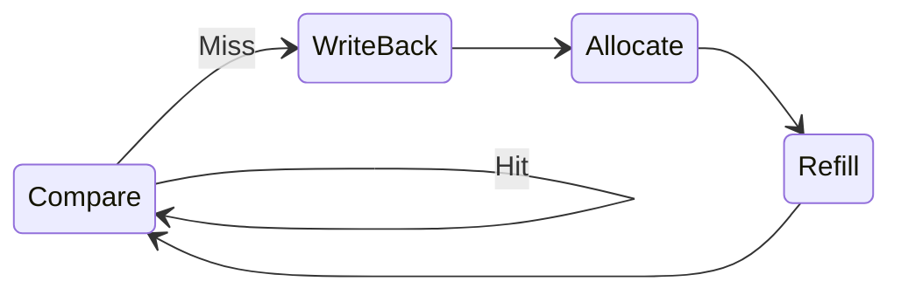

# Philippa's Personal Statement 

CID: 02596628

### Contributions

- [Overview](#overview)
    
### Analysis of my Work 
  
- [Control Unit, Instruction_Mem and Sign_extend](#control-unit-instruction_mem-and-sign_extend)
- [Testbenches](#testbenches)
- [Debugging](#debugging)
- [Multi cycled Cache](#multi-cycled-cache)
    
### Reflection 
  
- [Mistakes I Made](#mistakes-i-made)
- [Reflection](#reflection)

# Overview 

Core RTL (single-cycle CPU): implemented sign_extend.sv and instr_mem.sv, and wrote the ADDI and BNE decode/control in control_unit.sv. Contributed to jump/branch PC control logic alongside Aileen.

Verification (SystemVerilog): wrote directed + randomised unit testbenches for the Control Unit, ALU, and Register File (*_tb.sv) and used failures to drive RTL fixes.

Pipeline integration & debugging: resolved structural/wiring issues in top.sv (PC path, forwarding mux selection, reset behaviour, naming/width mismatches).

Multi-cycle data cache (stretch work): implemented a blocking, multi-cycle cache controlled by an FSM (COMPARE / WRITE_BACK / ALLOCATE / REFILL) with a cachestall handshake and address-latching for correct miss handling.

# Control Unit, Instruction_Mem and Sign_extend

Control Unit (ADDI / BNE + PC control integration)

I implemented the part of the control unit that decodes ADDI and BNE. The CU assigns safe default values to all outputs each cycle to avoid stale control signals. For ADDI, it enables register write and selects an I-type immediate as the ALU operand. For BNE, it selects a B-type immediate, performs rs1 - rs2 in the ALU, and sets PCSrc so the PC takes the branch when rs1 != rs2 (i.e., Zero == 0).
Aileen implemented the broader CU functionality beyond my instruction subset.

sign_extend.sv

I wrote sign_extend.sv to generate correct 32-bit immediates from raw instruction fields. For I-type instructions, it extracts instr[31:20] and sign-extends. For B-type branches, it reconstructs the split immediate from scattered fields, appends the low zero bit, then sign-extends. This required careful mapping from the RISC-V encoding — a single misplaced bit can send branches to the wrong target.

instr_mem.sv

I implemented instr_mem.sv as a minimal read-only instruction memory: load program.hex at simulation start and return RD = memory[PC[31:2]] for aligned 32-bit fetches. This made instruction fetch deterministic and helped debug PC control (branch/jump) in the pipelined CPU by removing memory timing as a variable.
Limitation: this is word-addressed and does not expose byte addressing/endian behaviour or support unaligned fetch / compressed instructions.

# Testbenches
## CU Testbench 

 
My CU testbench caught a design error in the CU: PCSrc was set to Immediate, not Jump. This demonstrates that using these testbenches throughout the project was crucial to the correct implementation of our CPU.

JAL was set to use the branch PC instead of initialising a new jump PC.

Another issue I found was that JALR was carrying stale control signals.

Our Control Unit initially failed several instruction tests because some outputs lacked default values, allowing stale control signals to persist and break JAL, JALR, and branch behaviour. We also incorrectly encoded the PCSrc constants and omitted an Immediate constant, which caused incorrect PC selection and a compile error. After adding complete default assignments and fixing the PCSrc encodings, all control signals behaved correctly and the CU passed the full testbench. Venice also wrote a C++ testbench for final integration.

After these fixes, the CU passed all directed cases (ADDI, BNE, JAL, JALR), and the waveforms matched the expected behaviour from the lecture slides.

## ALU Testbench 

The ALU was written by Venice. During the debugging stage, I decided to create a fully comprehensive SystemVerilog testbench to ensure full functionality of the ALU.

This included directed tests for all operations (ADD, SUB, AND, OR, XOR), corner-case checks (overflow and masking), and a set of randomised ADD tests. I created a reusable check() task to automatically compare ALU outputs with expected values.

During testing, I discovered a bug in the ALU: the Zero flag was being assigned twice, causing incorrect results for non-SUB instructions. I identified and fixed this issue by computing the Zero flag once from the final ALU output. After the fix, all tests passed under Verilator, confirming that the ALU behaves correctly and is ready for integration. Venice also wrote a C++ testbench for final integration.

The final ALU testbench runs ~N directed checks plus 100+ randomised ADD cases under Verilator with no failures, giving us strong confidence that the ALU is correct before integration.

## Reg_file Testbench 

The reg_file.sv module was initially written by Venice. As part of my debugging and verification work, I developed a dedicated SystemVerilog testbench for the register file used in our Reduced RISC-V CPU. The testbench generates its own clock, applies both deterministic and randomised test cases, and checks all key register behaviours, including x0 immutability, write-enable control, dual-port reads, and read-after-write timing.

A significant part of this work involved diagnosing why expected values were not being written or read correctly. This led me to identify issues related to register initialisation, write timing, and the testbench’s use of non-blocking assignments. By iterating on both the DUT and the testbench, I achieved a fully passing suite of directed and fuzz tests. This process improved my understanding of synchronous versus asynchronous behaviour in a register file and strengthened my confidence in writing robust verification code.

Following a change to perform register writes on the negative clock edge, all directed tests and random fuzz runs now pass reliably. I also confirmed the corrected behaviour using GTKWave.

# Debugging 

### After Pipelining 

During the debugging stage of the project, I focused on integrating all modules into the pipelined CPU and ensuring they operated correctly together under Verilator. A significant amount of time was spent resolving structural issues, including inconsistent module naming, incorrect port widths, and implicit nets created by typographical errors such as ALUoutW versus ALUOutW. I also identified and fixed wiring errors in top.sv related to PC control, instruction memory routing, and control-signal propagation between pipeline stages.

Numerous warnings from undriven signals, unused nets, width mismatches, and asynchronous/synchronous reset conflicts helped uncover hidden design defects that were not caught by the unit testbenches. After addressing these issues, I updated the testbench by removing leftover VBuddy calls so that it compiled and ran cleanly in the Verilator environment. Once the CPU executed the full F1 program successfully, I verified correct behaviour using GTKWave, inspecting PC progression, instruction flow, and stable control signals across the pipeline stages.

This debugging phase significantly improved my understanding of how small structural mistakes can cascade through a pipelined CPU, reinforcing the importance of consistent naming conventions, complete default assignments, and careful pipeline wiring.

# Main Issues I found 

## **1. JALR/JAL in CU** 

The CU didn't specify the difference between a JAL jump and and JALR jump, this caused issues in the 4_jal_ret test. 

One issue I ran into while implementing the Control Unit was with the jump instructions, JAL and JALR. At first, both instructions behaved inconsistently in simulation, and it took a while to realise that the problem wasn’t in the immediate generation or the ALU, but in the CU itself. We had only set a generic jump signal, meaning JAL and JALR were effectively treated the same, even though they require different PC sources: JAL jumps to PC + immediate, while JALR must use the ALU-computed address. Once I introduced distinct encodings for each jump type and routed them properly, the CPU immediately started behaving as expected. 

## **2. Forwarding Not Correctly Integrated**

Another issue found was in the Forwarding Unit wiring. The hazard detection logic existed, but the ALU inputs weren’t actually selected using ForwardAE and ForwardBE, so dependent instructions sometimes saw stale register values instead of the EX/MEM or MEM/WB results. I rewired the forwarding to follow the standard RISC-V convention: EX/MEM has priority (2'b10), then MEM/WB (2'b01), otherwise the register file (2'b00). This ensures the ALU always sees the latest operands for back-to-back ALU dependencies, while load-use hazards are still handled by the hazard unit with a one-cycle stall.

Another major issue was the Forwarding Unit wiring. The original design tried to do decode stage forwarding in some modules and not in others, and the ALU inputs weren’t really using ForwardAE/ForwardBE. I rewired it to do standard EX-stage forwarding, EX/MEM first, then MEM/WB, otherwise the register file, so the ALU now always sees the latest operands, with any remaining load-use cases handled by a one-cycle stall in the hazard unit.

## **3. Reg-File** 

The LUI test wasn’t passing, and I couldn’t work out why. When I opened GTKWave I realised that x1 was never being written – it stayed at zero for the whole run.

Originally, the register file was writing on the same clock edge that the rest of the design (and my testbench) was sampling values. That meant reads and writes were effectively happening at the same time, so the read ports could see either the old value or the new one depending on how the simulator scheduled events. In practice, this showed up as off-by-one behaviour: I’d write to a register and then read it straight away, but the testbench would sometimes still see the previous value.

To fix this, I moved the write logic to the negative edge of the clock:
    
    always_ff @(negedge clk) begin
        if (rst) ...
        else if (WE3 && AD3 != 0)
            regs[AD3] <= WD3;
    end

After this change, the writes happened cleanly between sampling points, and the LUI test started passing with x1 updating as expected.

# Multi-cycle Cache 

Aileen implemented the single-cycle data cache. I implemented the multi-cycle cache through a finite state machine I used states COMPARE, WRITE_BACK, ALLOCATE and REFILL to model realistic miss handling and asserted a cachestall signal back to the CPU whenever a miss was in progress.

In COMPARE I checked valid/tag and selected the word/byte lane for loads/stores. On a miss I moved to WRITE_BACK if the victim line was dirty, otherwise straight to ALLOCATE. WRITE_BACK streamed the old cache line to memory over multiple cycles, then ALLOCATE issued the read request for the new line, and REFILL captured the returned burst and updated the cache line (tag, valid, and dirty) before returning to COMPARE.

While in any miss-handling state I asserted cachestall so the pipeline would hold PC and prevent new memory operations. I also gated cache outputs so the CPU never observed partially updated data, and only deasserted cachestall once the refill completed and the requested word was guaranteed valid.

You track valid and dirty bits for each way so you can tell whether an eviction needs a write-back. Because the cache is set-associative, on a miss I needed a replacement policy to choose which way to evict; I kept this policy simple to keep the FSM small, but it could be upgraded to LRU by adding a small amount of per-set metadata.

One problem I had was that the original design assumed the memory address stayed constant, but in my multi-cycle version the address could change while handling a miss, so the wrong value was sometimes used in the miss states. I fixed this by latching the key signals at COMPARE and reusing those latched values throughout the miss-handling states. This exercise made me much more comfortable designing FSMs around memory systems and reasoning about timing and handshakes between modules.

# Auxiliary

I created a whatapp groupchat for easy communication, ensured team memebers communicated with one another by making sure we gave one another regular updates about progress with various modules.  
- Enforced consistent naming conventions across modules (signals, ports, and instance names) to avoid wiring mistakes and reduce Verilator warnings.
- Reviewed changes for consistency (port widths, reset naming, signal casing like `ALUOutW` vs `ALUoutW`) to prevent hard-to-trace integration bugs.

# Mistakes I Made

One mistake I made early on was writing the branch testbench before the rest of the pipeline was ready. Key modules hadn’t been implemented yet, so the testbench produced misleading errors and quickly became outdated as the design evolved. When I revisited it, most of the signals no longer matched the CPU, so I scrapped it and focused on writing dedicated CU and ALU testbenches instead.

One conceptual mistake I made was how I thought about instruction memory. I implemented it as logic [31:0] memory[0:255] indexed by PC[31:2]. In reality, RISC-V is byte-addressed and little-endian – my module was just a simplified, word-granularity model that only ever sees aligned 32-bit instructions.

The main mistake I made while debugging was not reading the Harris and Harris textbook carefully before I started. That meant I overcomplicated the design and added unnecessary logic that later had to be removed. If I’d spent a bit of time up front really understanding what the textbook expected, I would have saved a lot of time. Instead, I ended up misdiagnosing issues that actually had simple fixes.

# Reflection 

This project also forced me to internalise several hardware concepts that rarely show up in small lab exercises:

- How write timing (posedge vs negedge) affects register file semantics in a pipelined CPU
  
- Why hazard and forwarding logic must be designed around the exact pipeline stage ordering
  
- How little-endian byte addressing interacts with immediate generation and branch targets

Making (and then fixing) mistakes in each of these areas has given me a much deeper understanding than simply following the textbook design.

Looking back, this project taught me as much about workflow as it did about hardware. I’d now:

- Spend more time up front reading the textbook and agreeing a clear architecture and naming scheme as a team

- Only write full system-level testbenches once the main modules are stable, and rely on smaller unit testbenches earlier on.

- Be stricter about keeping the top-level and cache wiring simple and well-documented, so that later changes don’t turn into a wiring puzzle.

