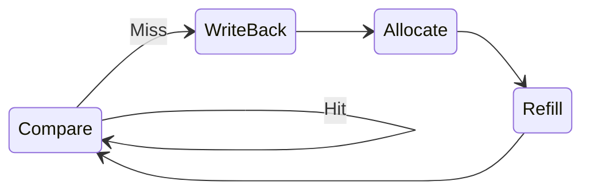

# Philippa's Personal Statement 

CID: 02596628

### Contributions

- [Overview](#overview)
    
### Analysis of my Work 
  
- [CU, Instruction_Mem and Sign_extend](#cu-instruction_mem-and-sign_extend)
- [Testbenches](#testbenches)
- [Debugging](#debugging)
- [Pipelining Cache](#pipelining-cache)
    
### Reflection 
  
- [Mistakes I Made](#mistakes-i-made)
- [Reflection](#reflection)

# Overview 

My main role was implementing cu, instruction_mem and sign_extend in the single cycle. Helping Aileen debug the pipelined CPU, writing testbenches and implemeting blocking cache for a multi-cycle CPU. I am grateful for this role as it gave me a good understanding of all of the modules and taught me how to debug. 

# CU, Instruction_Mem and Sign_extend

## CU 
I wrote part of the control unit that decodes ADDI and BNE. It sets safe default control signals, then for ADDI enables register write with an I-type immediate added in the ALU, and for BNE selects a B-type immediate, does rs1 - rs2 in the ALU, and sets PCSrc to take the branch when rs1 != rs2 (i.e. Zero == 0).

## Sign_extend 

I also wrote the sign_extend module to generate 32-bit immediates from the raw instruction bits. For I-type instructions it extracts bits [31:20] and sign-extends them, and for B-type branches it reconstructs the split immediate from the scattered fields and appends the low zero bit before sign-extending. This was a good exercise in carefully mapping the RISC-V encoding to hardware, as a single misplaced bit would send branches to entirely the wrong address.

# Testbenches
## Writing CU Testbench 
Initially, I wrote an incorrect branch_testbench discussed further in 'Mistakes I made'. I then wrote the CU testbench. 
My CU testbench caught a design error in the CU. PCSrc was set to Immediate, not Jump.

JAL set to branch PC instead of initalising a new jump PC. 

Also, found another error in which JALR was carrying stale control signals. 

Our Control Unit initially failed several instruction tests because some outputs lacked default values, so stale control signals persisted and broke JAL, JALR and branch behaviour. We also mis-encoded the PCSrc constants and omitted an Immediate constant, causing incorrect PC selection and a compile error. After adding full default assignments and fixing the PCSrc encodings, all control signals were correct and the CU passed the full testbench.

## ALU Testbench 

I wrote a comprehensive SystemVerilog testbench to verify the ALU. It included directed tests for all operations (ADD, SUB, AND, OR, XOR), corner-case checks (overflow and masking), and a set of randomised ADD tests. I created a reusable `check()` task to automatically compare ALU outputs with expected values.

During testing, I discovered a bug in the ALU: the Zero flag was being assigned twice, causing incorrect results for non-SUB instructions. I identified and fixed the issue by computing the Zero flag once from the final ALU output. After the fix, all tests passed under Verilator, confirming that the ALU behaves correctly and is ready for integration.

## Reg_file Testbench 

During this part of the project, I focused on verifying and debugging the Register File module for our Reduced RISC-V CPU. I built a complete SystemVerilog testbench that generates its own clock, applies deterministic and randomized test cases, and checks all register behaviours including x0 immutability, write-enable control, dual-port reads, and read-after-write timing. A large part of the work involved diagnosing why expected values weren’t being written or read, which led me to identify issues with initialisation, write-timing, and the testbench’s use of non-blocking assignments. By iterating through these problems and refining both the DUT and testbench, I achieved a fully passing suite of directed and fuzz tests. This process strengthened my understanding of synchronous vs asynchronous behaviour in the register file and improved my confidence in writing robust verification code.

# Debugging 
### After Pipelining 

During the debugging stage of the project, I focused on integrating all modules into the pipelined CPU and ensuring they worked correctly together under Verilator. A large amount of time was spent resolving structural issues, such as inconsistent module naming, missing files (e.g., `ME_WR_Reg`), incorrect port widths, and implicit nets created by typos like `ALUoutW` vs. `ALUOutW`. I also identified several wiring errors inside `top.sv`, particularly around PC control, instruction memory routing, and control-signal propagation between pipeline stages. 

Many warnings—undriven signals, unused nets, width mismatches, and asynchronous/synchronous reset conflicts—helped uncover hidden design defects that weren’t caught by the unit testbenches. After cleaning these up, I corrected the testbench by removing leftover VBuddy calls so that it compiled and ran fully within the Verilator environment. Once the CPU executed the full F1 program successfully, I confirmed the behaviour visually using GTKWave, inspecting PC progression, instruction flow, and stable control signals across the pipeline stages. This debugging phase improved my understanding of how small structural mistakes cascade through a pipelined CPU, reinforcing the importance of consistent naming, complete default assignments, and careful pipeline wiring.

# Main Issues I found 

## **1. JALR/JAL in CU** 

The CU didn't specify the difference between a JAL jump and and JALR jump, this caused issues in the 4_jal_ret test. 

One issue I ran into while implementing the Control Unit was with the jump instructions, JAL and JALR. At first, both instructions behaved inconsistently in simulation, and it took a while to realise that the problem wasn’t in the immediate generation or the ALU, but in the CU itself. We had only set a generic jump signal, meaning JAL and JALR were effectively treated the same, even though they require different PC sources: JAL jumps to PC + immediate, while JALR must use the ALU-computed address. Once I introduced distinct encodings for each jump type and routed them properly, the CPU immediately started behaving as expected. 

## **2. Forwarding Not Correctly Integrated**

Another major issue was the Forwarding Unit wiring. The hazard detection logic existed, but the ALU inputs weren’t actually selected using ForwardAE and ForwardBE, so dependent instructions sometimes saw stale register values instead of the EX/MEM or MEM/WB results. I rewired the forwarding to follow the standard RISC-V convention: EX/MEM has priority (2'b10), then MEM/WB (2'b01), otherwise the register file (2'b00). This ensures the ALU always sees the latest operands for back-to-back ALU dependencies, while load-use hazards are still handled by the hazard unit with a one-cycle stall.

Another major issue was the Forwarding Unit wiring. The original design tried to do decode stage forwarding in some modules and not in others, and the ALU inputs weren’t really using ForwardAE/ForwardBE. I rewired it to do standard EX-stage forwarding, EX/MEM first, then MEM/WB, otherwise the register file, so the ALU now always sees the latest operands, with any remaining load-use cases handled by a one-cycle stall in the hazard unit.

## **3. Reg-File** 

The LUI test wasn’t passing, and I couldn’t work out why. When I opened GTKWave I realised that x1 was never being written – it stayed at zero for the whole run.

Originally, my register file was writing on the same clock edge that the rest of the design (and my testbench) was sampling values. That meant reads and writes were effectively happening at the same time, so the read ports could see either the old value or the new one depending on how the simulator scheduled events. In practice, this showed up as off-by-one behaviour: I’d write to a register and then read it straight away, but the testbench would sometimes still see the previous value.

To fix this, I moved the write logic to the negative edge of the clock:
    
    always_ff @(negedge clk) begin
        if (rst) ...
        else if (WE3 && AD3 != 0)
            regs[AD3] <= WD3;
    end

After this change, the writes happened cleanly between sampling points, and the LUI test started passing with x1 updating as expected.

## Mistakes I made while Debugging 

The main mistake I made while debugging was not reading the textbook carefully before I started. That meant I overcomplicated the design and added unnecessary logic that later had to be removed. If I’d spent a bit of time up front really understanding what the textbook expected, I would have saved a lot of time. Instead, I ended up misdiagnosing issues that actually had simple fixes.

# Pipelining Cache 

Ailleen wrote a cache that worked in a single-cycle it was my job to pipeline it. I choose to use a finite state machine, because cache misses and refills happen as a sequence of timed steps and an FSM cleanly controls those actions across multiple cycles. I wrote 4 stages: COMPARE, WRITE_BACK, ALLOCATE and REFILL. 

One problem I hit was that the original design assumed the memory address stayed constant, but in my multi-cycle version the address could change while handling a miss, so the wrong value was sometimes used in the miss states. I fixed this by latching the key signals at COMPARE and reusing those latched values throughout the miss-handling states.

# Mistakes I made 

One mistake I made early on was writing the branch testbench before the rest of the pipeline was ready. Key modules hadn’t been implemented yet, so the testbench produced misleading errors and quickly became outdated as the design evolved. When I revisited it, most of the signals no longer matched the CPU, so I scrapped it and focused on writing dedicated CU and ALU testbenches instead.

Although these mistakes slowed my progress, they significantly improved my understanding of pipeline structure, testbench design, and debugging methodology. They also helped me develop a more disciplined workflow, where I write testbenches only when the underlying hardware is stable and review modules systematically for naming and structural correctness.

# Reflection 

Looking back, this project taught me as much about workflow as it did about hardware. I’d now:

- Spend more time up front reading the textbook and agreeing a clear architecture and naming scheme as a team.
    
- Only write full system-level testbenches once the main modules are stable, and rely on smaller unit testbenches earlier on.
    
- Be stricter about keeping the top-level and cache wiring simple and well-documented, so that later changes don’t turn into a wiring             puzzle.

